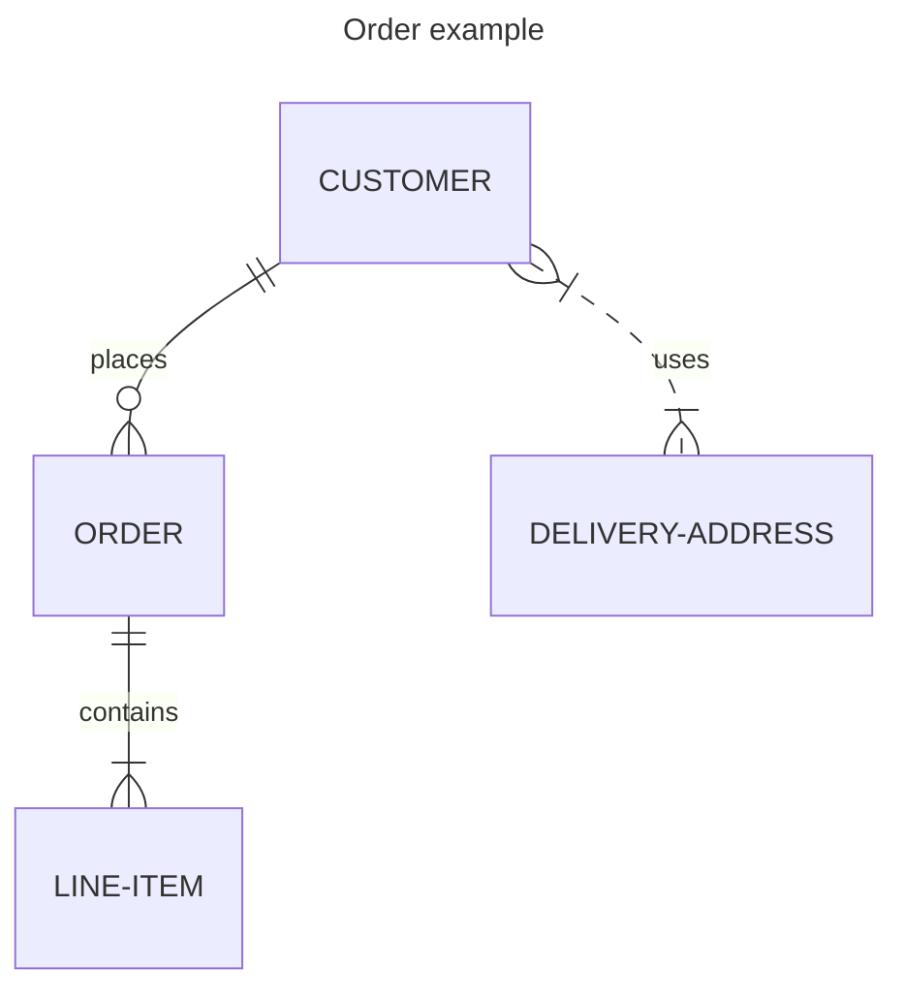

```pikchr
arrow right 200% "Markdown" "Source"
box rad 10px "Markdown" "Formatter" "(markdown.c)" fit
arrow right 200% "HTML+SVG" "Output"
arrow <-> down 70% from last box.s
box same "Pikchr" "Formatter" "(pikchr.c)" fit
```



