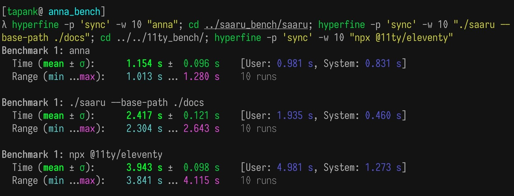
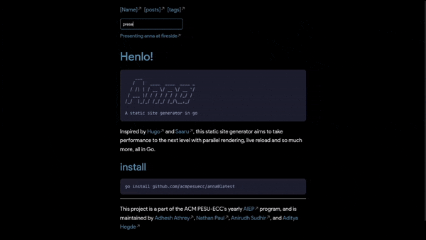
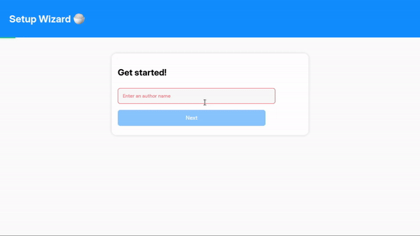

---

> This post is WIP(work-in-progress) and has been authored by [Adhesh](https://github.com/DedLad), [Aditya](https://github.com/bwaklog), [Nathan](https://github.com/polarhive) and [Anirudh](https://github.com/anirudhsudhir).

There are several amazing static site generators(SSG) out there, like [Hugo](https://gohugo.io/) and
[11ty](https://www.11ty.dev/). Building your own SSG is an amazing learning
experience. It also motivates one to maintain and improve their personal site.

Building personal blogs from the ground up can be a _tedious process_. Some of us
have had our hands deep in vanilla HTML and CSS, which isn't fun to maintain. We
all want to get to the point and share our thoughts on the web. But, there is a
small hurdle that stops us from doing so.

Maintaining your personal site is like working with your own Neovim
configuration. Every issue fixed would lead to an entirely unrelated bug. There
is a lot of time spent fixing things rather than getting productive work done.

> A static site generator is an immensely useful application


Lighthouse scores of the anna-docs page

It can simplify the whole process: allowing you to spend time and energy
on quality content. Keep reading to find out how we designed anna.

---

## Introduction

ACM-PESU ECC conducts the ACM Industrial Experience Program (AIEP), an annual program that spans six weeks.

It involves students working as a team to develop an industrial-level project.
AIEP intends to give students hands-on experience with real-world projects.
It is an excellent opportunity to interact with like-minded individuals.

Our AIEP team consisted of [Adhesh](https://github.com/DedLad), [Aditya](https://github.com/bwaklog),
[Nathan](https://github.com/polarhive), and [Anirudh](https://github.com/anirudhsudhir).

Our mentors (cool senior names!) gave us some great ideas for our team of four freshers.
We were puzzled whether to build a distributed Postgres clone or a load balancer.

Deep discussions over a week got us to the topic of making blog sites and how tiring it is to work with, which only gets worse as you
write more and more content for your internethome.

This and inspirations from [Saaru](https://github.com/anirudhRowjee/saaru) and [Sapling](https://github.com/NavinShrinivas/sapling) pushed us to tackle this problem with our own SSG.

```text
    ___
   /   |  ____  ____  ____ _
  / /| | / __ \/ __ \/ __ `/
 / ___ |/ / / / / / / /_/ /
/_/  |_/_/ /_/_/ /_/\__,_/

A static site generator in Go

```

## The small but big decision!

Anna is written in [Go](https://go.dev).
We considered writing it in Rust, but it came with a steep learning curve.
Go is a powerful language and has excellent concurrency support, which suited our requirements to build a performant application.

### What's in a name?

Probably the first thing that the four of us came across when joining ACM and HSP was the famous [Saaru](https://github.com/anirudhRowjee/saaru) repository, one of the projects that inspired our ssg.
Saaru is a thin lentil soup, usually served with rice and is a [Kannada](https://en.wikipedia.org/wiki/Kannada) word.

> In Kannada, rice is referred to as 'anna' (ಅನ್ನ) pronounced <i>/ɐnːɐ/</i>

This was just a playful stunt that we engaged in.
We planned on beating Saaru at site render times, optimizing at runtime.

---

## Genesis

We began the project in a unique manner, with each of us creating our own prototype of the SSG.
This was done to familiarize everyone with the Go toolchain.

The first version of the SSG did just three things.
It rendered markdown (stored in files in a content folder in the project directory) to HTML.
This HTML was injected into a layout.html file and served over a local web server.
Later, we implemented a front matter YAML parser to retrieve page metadata

---

## What made us develop this to a great extent?

- Beginner-friendly: An easy setup wizard, ready to use layouts, and themes.
  We wanted the process of typing out a blog and putting it up on your site to be short and simple.

- Speed: Render sites in a flash (hugo – written in Go, is remarkably fast)

- Maintainable: This ssg would be used by us, hence it should be easy to fix bugs and add new features

- Learning curve: None of us had really shipped a production-ready application.
  Since AIEP is all about making industry-ready projects, we chose to use Go: so we could spend more **writing** code
  and not worrying about our toolchain or escaping dependency hell.

- Owning a piece of the internet: Aditya and Anirudh registered their own domain names.
  Now their anna sites live on [hegde.live](https://hegde.live) and [sudhir.live](https://sudhir.live).

---

## Benchmarks! Can anna lift??

In simple terms, to beat Saaru's render time (P.S. we did beat the initial version!).
Something you probably never notice while deploying, but it is what pushed us to spend hours on this.

Adhesh was pretty excited to pick up Go and implement profiling, shaving
milliseconds off build times, when he implemented parallel rendering using goroutines.

### We cook! 🍳

Here are some images that demonstrate build times, profiling et-al when having thousands of markdown files or in this case
just copy-pasting a single markdown file en-mass!


Hyperfine benchmarks comparing the render times of anna, Saaru and 11ty

> 2 weeks into the project, we had a PR bringing parallel rendering and profiling to the table

---

## Profiling

For those who love to get technical, anna has a profiling flag and a debug endpoint(available during live reload).
This flag prints the profile data of the rendering process to stdout.
The debug endpoint displays the data for site render in the live reload mode, which can be visualised by navigating to the specified pprof endpoint

<!-- Here's the CPU profile generated while rendering this site.
This is an SVG showing how much time each function call takes, the number of times it ran in a given test sample and various other useful information.


You may wanna zoom-in about 3-4x times to get to see how our ssg works -->

---

## Live Reload

anna can be run in a serve mode which serves the rendered site over localhost.
It also includes live reload, which performs a re-render of the site for every change made to the markdown content.
It also injects a script which auto-refreshes the browser on a site re-render.

### Initial version

The initial version consisted of a multi-goroutine system.

1. A new goroutine would be spawned to walk the required content directories.
If the current path being walked was a file, the path would be passed to another function along with its current modification time.

2. The previous mod time of the file would then be retrieved from a map holding the mod times of all the files:

- If the given file was freshly created, its modification time would be added to the map.
- If there was no change in the mod time, no changes would be made.
- If there was a change between the current and previous mod times, a re-render of the site would be performed.

3. The site re-render function checks if a child process is running:

- For the first render, when a process has not been created, a new process is created that runs anna ("go run main.go --serve")
- For successive renders, the existing process is killed and a new process is spawned once again that runs the application.

This prototype was not very efficient as it created and killed processes for every change.
It had multiple goroutines attempting to walk the directories at the same time, which also required multiple mutual exclusion locks to prevent data races.
This was designed as a standalone component and integrating this proved to be challenging.

### Improvements

The updated version of live reload utilised two goroutines.

The main goroutine used the initial file walker, with one important change: it sequentially traversed the directory without spawning new goroutines.
For any modification to a file in the current traversal, a vanilla render of the entire site would be performed.
The goroutine would then sleep for a specified duration (currently 1 second) before attempting the next directory traversal.

The secondary goroutine ran a local web server that served the rendered/ directory.

This eliminated all locks and avoided the creation and destruction of child processes.

### Browser reload (WIP)

When anna performs a re-render of the site, the browser is automatically refreshed to reflect the latest changes.
This involved utilising server-sent events(SSE).
A script was injected into all pages that polled a particular port.
On receiving an event sent by anna during the re-render, the script would reload the page.

---

(The following content is WIP)

## A big rewrite (when we went for a TDD approach)

Starting off this project, we kept adding functionality without optimization.
We did not have a proper structure; PRs would keep breaking features and overwriting functions written by team-mates.

> We dived into the codebase to rebuild the application following a TDD-approach.

### A new proposed rendering system

#### main.go

Firstly, we refactored main.go to only handle flags.
The rest of the program logic was moved to other packages.
A benchmark for main.go was also written to time the entire application.

#### pkg/ modules

Modules previously part of `cmd/anna/utils.go` and `cmd/anna/main.go` were to be split between `pkg/parsers/`, `pkg/engine/` and `pkg/helper`

```text
pkg
├─── helpers
│   ├─── helpers.go
│   └─── helper_test.go
├─── engine
│   ├─── anna_engine.go
│   ├─── anna_engine_test.go
│   ├─── engine.go
│   ├─── engine_test.go
│   ├─── user_engine.go
│   ├─── user_engine_test.go
│   └─── engine_integration_test.go
└─── parsers
	├── parser.go
	├── parser_test.go
	└── parser_integration_test.go
```

> - Wrote unit and integration tests for the parser and engine package

#### Splitting the render pipeline

Currently, there are three kinds of files that have to be rendered.
One set includes user-defined files such as `index.md`, `docs.md` and various posts. These are specific to a user.

The second set of files that are rendered include `tags.html` and `posts.html`, which are present on every site rendered by anna.

The third set of files included the tag-sub pages.
For every tag, there would be a corresponding sub-page containing all of the posts with the same tag.

> - Split the rendering system to make parallelisation easier by switching to a three method system.

> - Render "user defined" pages which include all markdown files and posts (This method has been parallelised, Render tags and tag-sub pages separately, which could be parallelised in the future

---

## Useful features

### Tags

You can tag posts by hand, at the start of each markdown file and you get a
nice sub-page on your site so readers can discover similar content or browser
by category.

- Organizing posts into collections based on tags
- Reverse search for posts of a certain category

---

### To search or not to search? 🤔

> That is the question > Is our _static site_ becoming dynamic and at what cost?

We were wondering if we’d need a search function on our site since Google and
any other web-crawler index our site anyway.
If we needed to implement it, we had a constraint: do not use an API.
It had to be static and local to be user-friendly to work with.
We implemented a JSON index generator that uses "Deep Data Merge" to index posts on our site.

This index is generated during the site render and functions without any lag or noticeable delay when searching across posts.
We mean to re-write it using WASM if necessary.

Here's a gif demonstrating search



### JS integration as plugins

We added a field to the frontmatter which lets you pick and add certain JS
based snippets to your site.
This way, you get to add `highlight.js` support, analytics scripts and donation page widgets; that you can source from the `static/scripts` folder and toggle as needed per-markdown page.

### Wizard

An important ease-of-use feature was a GUI; a web-based wizard that let's a new user
setup anna along with a couple of easter eggs along the way 🍚

The wizard lets a user pick a theme, enter your name, pick navbar elements, and
validates fields using regex checks so you don’t need to worry about relative
paths in baseURLs, canonical links, and sitemaps. After successfully completing
the setup, the wizard launches a live preview of your site in a new tab.



### Raw HTML

What if you'd want to add a contact form to your site? or embed YouTube videos or iframes of your choosing?

Anna let's us do that! Although, the point of a static site generator is to
quickly get to writing and focusing on the content.
You can still embed js elements and iframe as needed to showcase any interesting YouTube videos or to just rickroll people!

---

## changelog: showcasing important additions, which are yet to be added to this blog

- Deep Data Merge
- Style feed.xml
- Site bootstrapping

---

## Next steps

- Wizard theme repo
- Performance: Explore memory-mapping, etc

---

## Feedback? / Learnings

We have a lot of things in store and bugs to squash!

> Feel free to ask any questions / send feature requests you'd like to see?

This blog post misses out of many not-so well documented features and learnings that
we got during midnight calls and the patches we kept sending each other fixing trivial but
interesting issues.
Have a look at our [GitHub](https://github.com/anna-ssg/anna/issues), for more

---

Today, we use [anna](https://github.com/anna-ssg/anna/releases/latest) on our personal sites:
[hegde.live](https://hegde.live) // [sudhir.live](https://sudhir.live) // [polarhive.net](https://polarhive.net)

01100001 01101110 01101110 01100001
