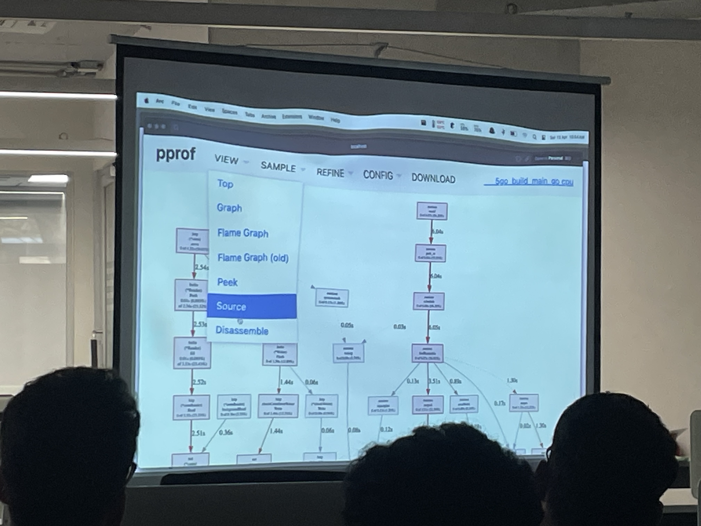
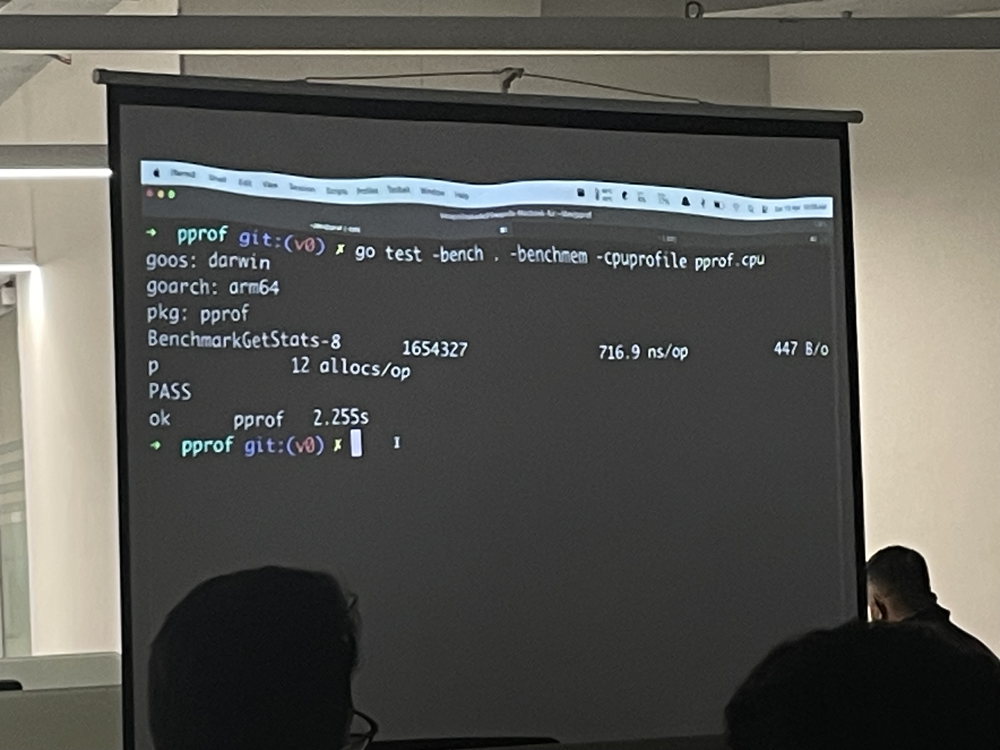
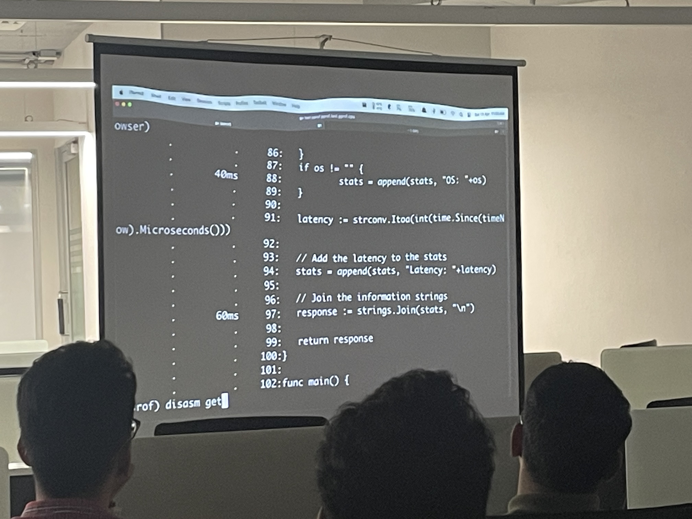
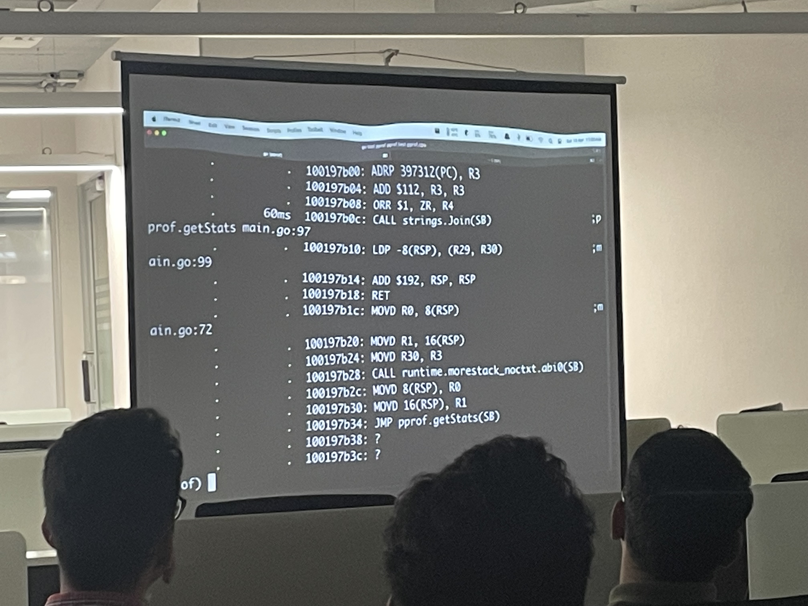

---

This post contains notes from a hands-on talk during the Go Bangalore April meetup.
Various profiling techniques were explored to improve the performance of a sample application.

## Introduction

The Go standard library has several built-in mechanisms for profiling:

1. Using [net/http/pprof](https://pkg.go.dev/net/http/pprof) as a blank import to profile a running application (such as a backend service)
2. Using various profiling flags present in the go test command
3. Utilising the [runtime/pprof](https://pkg.go.dev/runtime/pprof) library to profile a certain block of code

---

### Using the net/http/pprof package as a blank import

On performing a blank import of net/http/pprof, Go automatically attaches a debug/pprof endpoint to the application.
This endpoint contains an interactive web console which can be used to analyse the live profile data.

---

### Using various profiling flags present in the go test command

The go test command has several flags to profile an application. During the talk, the following two were covered:

- `benchmem` - Prints memory allocations for benchmarks
- `cpuprofile file` - Writes a cpu profile to file

Usage

```sh
go test -bench . -benchmem -cpuprofile pprof.cpu
```

The cpuprofile flag generates a binary and a file that can analysed using pprof.

```sh
go tool pprof app.test pprof.cpu
```

---

## Walkthrough

The demo used for the talk was a simple web application that returned the user agent and latency of the endpoint.
During the load test of the initial version using wrk, it handled an average of 33,000 requests per second. While impressive, this number could be improved.

### Initial investigation

The speaker first performed a benchmark using `net/http/pprof` to identify possible bottlenecks.

```
go tool pprof -seconds <duration> -http <profiling_url> <debug/pprof/profile_url_endpoint>
```

The profile of the application can be generated using the above command.

The data can be visualised in different forms, such as a graph or a flame graph.

During the session, the regular graph was used.
It displayed the total runtime of each function call, the number of times it was invoked and other useful details.

A lot of time was taken by os.Hostname() present in the handler function. The os.Hostname() function retrieves the hostname of the machine, which is a syscall. By moving the call outside of the handler and invoking it just once, the total runtime of the function reduced from 2s to 0.2s.



---

### Analysing line-by-line performance

The next step was to use the profiling flags present in the go test command to understand the time taken during different operations. By using the`cpuprofile file` flag, the profile will be written to a file for further analysis.



As seen above, the memory allocation for the benchmark is printed to stdout. Here, the application performed 12 allocations for a total of 447 bytes per operation.

```
go tool pprof <binary_name> <profile_file>
```

This command starts an interactive application. Commands such as `web` and `disasm` can be used to understand different parts of the profile.

The `list <function_name>` command displays the time time taken by certain operations of the particular function.



The `disasm <function>` command shows the assembly code of the function along with the time taken by some operations.



---

### Utilising string buffers and sync.Pool

The analysis of the results revealed that string slice appends were consuming most of the time. These operations involve repeated memory allocations to increase the slice capacity.

As the string slice was returned at the end of the function, a string buffer could be utilised to store and append the contents of the response. By creating a bytes.Buffer and using WriteString() to add contents to it, the number of allocations and time taken could be reduced.

Lastly, the number of allocation of bytes.Buffer objects could be reduced by using a sync.Pool. A sync.Pool is a type that holds a set of temporary objects.
These objects can be reused later, leading to fewer allocations. The pros of using a sync.Pool outweigh the cons as a bytes.Buffer object created during one request could be reused later.

After all of these optimisations, each operation took about 520ns, a huge improvement from the 716ns reported by the initial benchmark.
